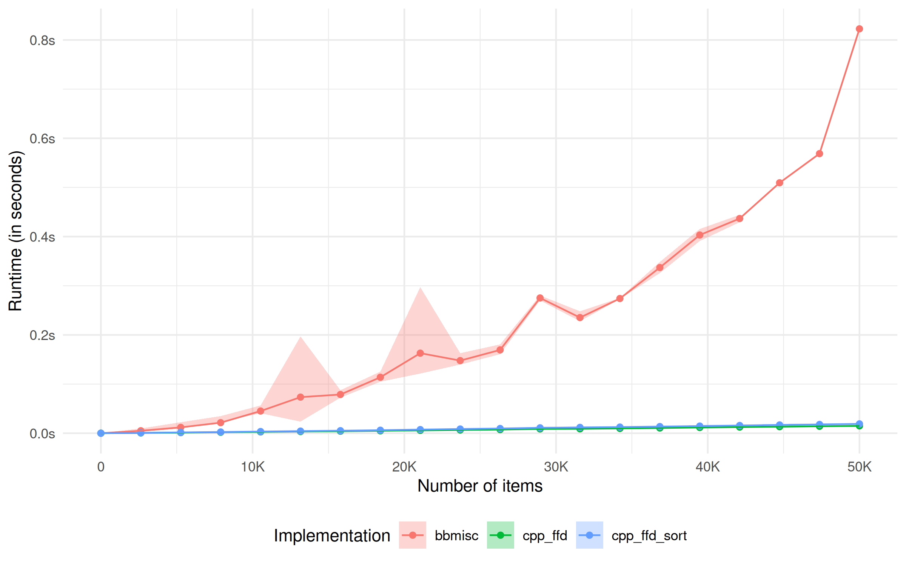
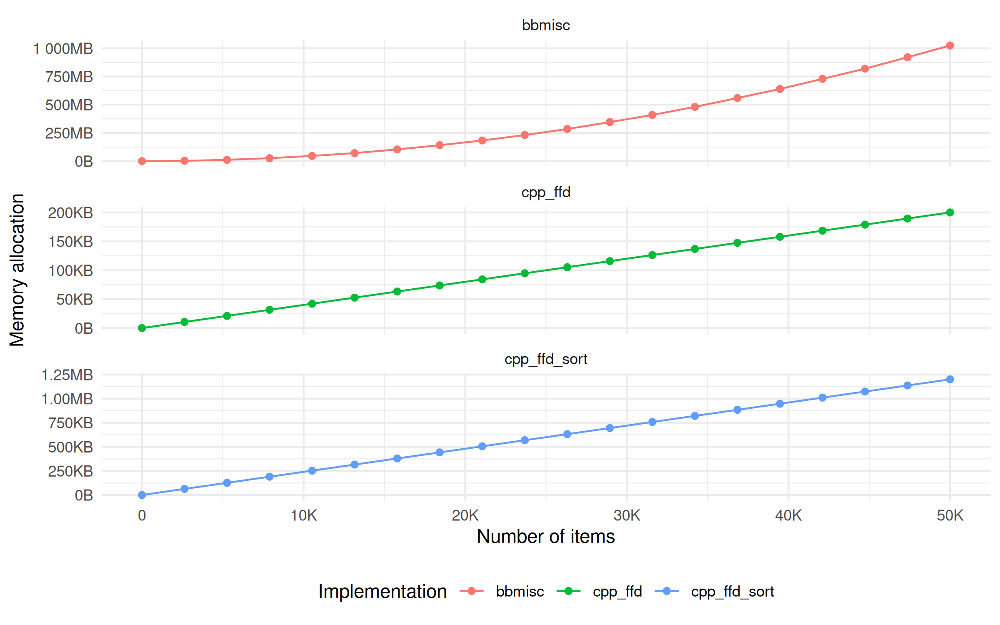

<!-- README.md is generated from README.Rmd. Please edit that file -->

# binpackr

<!-- badges: start -->

[](https://github.com/lschneiderbauer/binpackr/actions/workflows/R-CMD-check.yaml)
[](https://app.codecov.io/gh/lschneiderbauer/binpackr?branch=master)
[](https://lifecycle.r-lib.org/articles/stages.html#experimental)
[](https://CRAN.R-project.org/package=binpackr)

<!-- badges: end -->

This package implements the First Fit Decreasing algorithm to achieve
one dimensional heuristic bin packing. Its run time is of order
$\mathcal{O}(n\,log(n))$ where $n$ is the number of items to pack.

## Installation

You can install the development version of binpackr from
[GitHub](https://github.com/) with:

``` r
# install.packages("devtools")
devtools::install_github("lschneiderbauer/binpackr")
```

## Example

This is a basic example which shows to retrieve the solution for the bin
packing problem.

``` r
library(binpackr)

# Generate a vector of item sizes
x <- sample(100, 1000, replace = TRUE)

# Pack those items into bins of capacity 130
bins <- bin_pack_ffd(x, cap = 130)

# Number of bins needed to pack the items
print(length(unique(bins)))
#> [1] 386
```

## Benchmarks

The implementation in this package is compared to an implementation of
the same algorithm in the
[BBmisc](https://github.com/berndbischl/BBmisc) package. The authors
made in clear via the function documentation that speed was none of
their concern. Further their implementation is written in R while this
package uses a C++ implementation. Indeed, as expected, the current
implementation is superior in terms of run time and memory consumption.

### Run time



### Memory allocation


